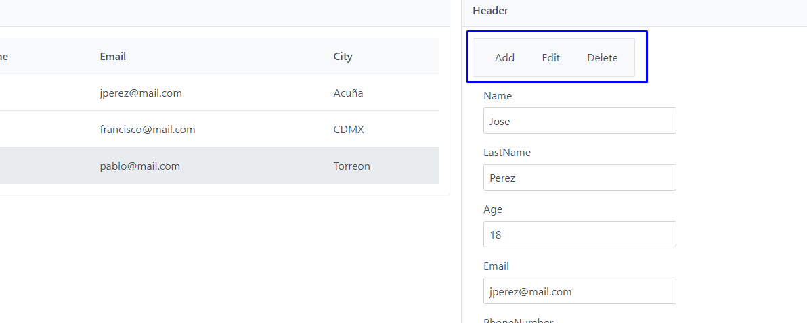

# Crud Users

## Install

### Required

Docker is required for the correct functionality of the appliance.

### Download

To download the project, run the following command:

```bash
git clone https://github.com/esGarciaM/Crud_users.git
```
### Installation

Navigate to the main folder that contains the `docker-compose.yml` file. Run the following command to build and start the project:

```
docker-compose up --build
```
The project will be deployed at the following URLs:

    Backend: http://localhost:80
    Frontend: http://localhost:81

## Usage

Usage
The application includes three buttons: Add, Edit, and Delete. As the names suggest, these buttons are for:

- Add: To add a new record.
- Edit: To edit an existing record.
- Delete: To delete the selected record.

__
    

When you press the Add or Edit button, the buttons to save changes will appear, and the input fields will be enabled. Once you save the changes, the buttons will be hidden, and the input fields will be disabled to prevent further edits during operation.